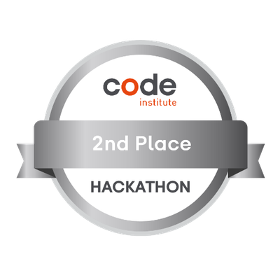

# Jaimie Hemmings

## Full Stack Web Developer

### About Me 👋

Thanks for checking out my GitHub Profile!

I have several years experience working front end development at various Web Development agencies and have recently undertaken the Level 5 Diploma in Full Stack Web Development delivered by Code Institute in partnership with East Kent College.

I am a highly motivated individual with a passion for continued learning. I love helping organizations solve complex and challenging real-world problems using innovative web applications and tech-based solutions.

### Contact Me

## Hackathons

| July 2024 - Proud Coders     | I participated in the Code Institute Hackathon themed around the LGBTQ community. Tasked with identifying and contributing to the resolution of a real world problem faced by the community. We were randomly assigned to groups of between 4 and 6 individuals in size. My team and I decided to focus on addressing some of the misconceptions often faced by members of the community and the history of the community. Alongside this we also developed a small interactive quiz for users to test their knowledge after reading the educational material on the site. [Badge Accreditation](https://api.eu.badgr.io/public/assertions/InW-WnD_QG-fHYtmsBkTag?identity__email=jwarbz%40gmail.com) - [View Repo](https://github.com/Declan444/24-7-hackathon-team9) |  | **2nd Place** |
|------------------------------|----------------------------------------------------------------------------------------------------------------------------------------------------------------------------------------------------------------------------------------------------------------------------------------------------------------------------------------------------------------------------------------------------------------------------------------------------------------------------------------------------------------------------------------------------------------------------|-------------------------------------------------------------|---------------|
| August 2024 - Pixel Pioneers | Another hackathon organised by Code Institute, this time themed around retro games. My team and I decided to make a duck hunt inspire arcade click shooter. This was a great experience for me as I got to dive in and explore the Canvas element in much greater details than I had before. We had several game features that had to be removed from the final product as we began to realise the scope of what was involved in such a short time frame but I still thoroughly enjoyed the experience of working with my team. [Badge Accreditation](https://api.eu.badgr.io/public/assertions/iv6HyCmrQFW4x8ivRWYHZA?identity__email=jwarbz%40gmail.com) - [View Repo](https://github.com/olliesharp5/august-hackathon-team1)                                            |  | **2nd Place** |

# My Tech Stack

- I'm comfortable with...

  
  
  
  
  

  
  
  
  

- I'm continuing to learn...

  
  
  
  

- Automated Testing

  
  

- Databases...

    
    
    
    
 

